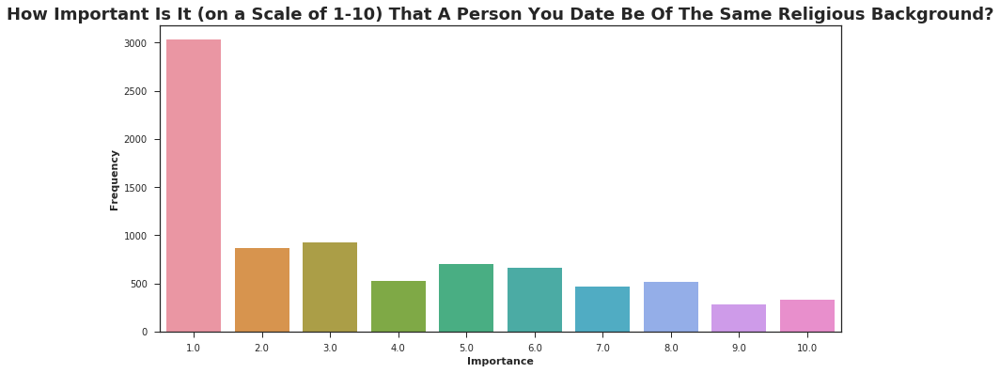
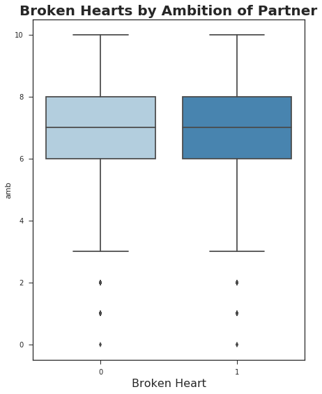

.. Speed Dating Project documentation master file, created by
   sphinx-quickstart on Tue Nov 27 09:37:40 2018.
   You can adapt this file completely to your liking, but it should at least
   contain the root `toctree` directive.

.. toctree::
   :maxdepth: 2
   :caption: Contents:

What is the Secret to Getting the Second Date?
===================================================
*DS-320 Data Visualization:*
*Carly Mester, Hans Larson*

**What influences love at first sight? (Or, at least, love in the first four minutes?)**

Introduction:
---------------

* Data was gathered from 552 participants in experimental speed dating events from 2002-2004. Each participant had multiple rows that represented each of their dates.

* This experiment was created by Columbia Business School professors Ray Fisman and Sheena Iyengar for their paper *Gender Differences in Mate Selection: Evidence From a Speed Dating Experiment*.

* During the events, the attendees would have a four minute "first date" with every other participant of the opposite sex.

* At the end of their four minutes, participants were asked if they would like to see their date again. They were also asked to rate their date on six attributes:
    * **Attractiveness**
    * **Sincerity**
    * **Intelligence**
    * **Fun**
    * **Ambition**
    * **Shared Interests**
    
* The dataset also includes questionnaire data gathered from participants at different points in the process. These fields include:
    * Demographics
    * Self-Perception Across Key Attributes
    * Beliefs on What Others Find Valuable in a Mate
    * Lifestyle Information
    
    
    
    
    
Cleaning the Data:
--------------------
   Although we originally thought that having multiple rows represent one individual would cause problems, we discovered that it was actually beneficial to the accuracy of our data.  The advantage of having multiple rows for each individual participant is that we can get multiple opinions on an individual’s attributes instead of just one.  This allows for more accurate results.
   
   However, we discovered that there were some columns and rows that could have possibly affected our results negatively.  We decided to take out columns that were missing large amounts of data and were not that important for the question that we were asking (the data set contains 190 columns, so we were not very worried about taking some out).  We took out these columns in python using “iloc” to select our columns and “concat” to put all of them together into a new data frame.  This allows us to go back and add any columns that we took out in case we needed them in the future.  Taking these columns out in Excel, or directly from the csv, would permanently delete these columns, not allowing us to add any of the columns back if we needed them.  It also allows us to use pandas’ “dropnas” without deleting rows that have N/As in columns that we do not need.
   
   We also discovered that one of the speed dating waves, wave 12, would affect our data negatively.   This particular wave had a certain restriction that was inconsistent with the rest of our data.  **In wave 12, the participants were only allowed to say yes to a second date to 50% of their dates**.  We decided that these rows risked affecting our results negatively.  Since we have thousands of observations in this data set anyway, we decided that it would be beneficial to our analysis if we removed wave 12 from our data frame.

Experimenting With the Data
------------------------------

.. figure:: CorrelationHeatmap.png

In the beginning of our exploration, we thought about making a scatterplot matrix of all of the activity interest values (i.e. sports interest from 1-10), but found a much better way of visualizing correlations, called a heatmap matrix.  This showed us correlation on a scale from dark color (low correlation) to light color (high correlation).  From this, we were able to see that some interests, like sports and TV sports, or art and museums, had high correlation with each other, indicating that if people were interested in art, they were more likely to be interested in museums, and the same for sports and TV sports. Some examples of interests that did not correlate quite often involved sports and fine arts-related activities.

.. figure:: RacialPreference.png

From these bar graphs, we found an answer to an early question that we had.  For whether or not it was important that a person you date has the same racial and religious background (on a scale of 1-10), we found that both graphs were very similar.  **Most people, by a large margin, had no preference (score of 1), and very few people preferred that racial and religious background of their partner be the same as theirs (score of 10)**. Later, we’ll discuss how racial and/or religious preference impact your likelihood of getting a second date.

Even if a participant received a match, a majority of them did not call their match.

We noticed the same pattern with participants’ matches, who also chickened out and did that call.  This could be due to the participants being nervous about contacting the person, even when they knew they had a match.

.. figure:: MatchesYouHaveDated.png
Most people, regardless of how many matches they received, only picked one match to go on a date with. Perhaps more people want to be loyal or simply feel better about dating when they are just dating one person.

Formulating Our Question
-------------------------
From experimenting in python with our data, we decided to focus on a single, overarching question: **What is the secret to getting a second date?**  To solve this question, we first looked at each genders’ responses to questions regarding each of the six main attributes.

.. figure:: WhatParticipantsLookForinOppositeSex.png
    :align: center

We can see that there is a great difference between what male and female participants are looking for.
Men are mostly looking for attractive women, while women are looking for a well-rounded man. Women prefer intelligence, sincerity, and fun about as much as attractiveness. For male participants, the attractiveness of the female is given a lot more weight, and the ambitiousness or if they have any shared interests are not ranked as high. For females, the points are more evenly distributed across all of the attributes, with intelligence ranked slightly higher compared to others.

.. figure:: WhatParticipantsThinktheOppositesexisLookingFor.png
    :align: center
    
Both men and women can predict what the opposite sex are looking for in their partners to a certain degree. Women strongly feel that men are most concerned with a woman’s attractiveness and that other attributes are not as important, especially ambitiousness.
Comparing female and male answers in the first graph, we can see that there are not that much differences between the two. We can say that women almost accurately predicted what men are looking for in their partners (i.e. attractiveness).
Additionally, men’s predictions were not far off either. By comparing males’ responses here and female’s responses in the first graph, what men think women are looking for also closely resembles what women say they are looking for. The main differences, though, are a higher attractiveness score and a lower shared interest score.

It is interesting to note in the first graph, on average, men allocate approximately 27/100 points for attractiveness. However, on average in the second graph, women think that men are allocating approximately 36/100 points for attractiveness. From this, women think men in general are more shallow than they actually are (even though they are somewhat).
	
	

.. figure:: Self-Evaluation.png
    :align: center
While there is no point allocation, on average, both genders do not rate themselves any lower than a 7/10 in these attributes. It is interesting to note that there is very little variance between male and female self-evaluation. Also, it is interesting to see that the perception of self intelligence gets the highest ratings when the perception of self attractiveness gets the lowest. (Shared interests cannot be a field because you cannot rate yourself on whether you have shared interests with yourself).

.. figure:: BrokenHeartRacialPreference.png
    :scale: 75 %
    :align: center

When looking at box plot comparisons of broken hearts by religious and racial preference (on a scale of one to ten, how important is it that your partner be the same race/religion as you?), we were surprised to see that both comparisons had matching box plots, indicating that **racial and religious preference had no significant impact on broken hearts**.

.. figure:: BrokenHeartAttractiveness.png
    :scale: 75 %
    :align: center
.. figure:: BrokenHeartFun-ness.png
    :scale: 75 %
    :align: center
.. figure:: BrokenHeartIntelligence.png
    :scale: 75 %
    :align: center

The only box plot comparison that appears to be different from the others is intelligence.  For broken hearts, the observations are between a six and a ten score for intelligence, while matches are between three and ten.  However, this is not a significant difference, because 50% of the data is still centered between a 6 and an 8 score for intelligence, and broken hearts have several outliers below an intelligence score of six, indicating that a participant’s intelligence does not appear to affect their chances of having a broken heart.

Interestingly enough, although our bar graphs showed that people generally prefer that their partner is attractive and intelligent, when looking at these plots, a participant’s grade by their partner does not seem to affect whether the participant has a broken heart or does not have a broken heart.  This suggests that none of these characteristics matter when securing a second date.  It instead suggests that there may be other variables present that cannot be measured on a scale of 1-10.  **In the end, it is clear that you should just be yourself and not worry about what your grade may be on certain characteristics**.

Conclusion
-----------
Although this is slightly disappointing, it looks like there is no definitive answer to getting a second date. It's not interests, attractiveness, or other traits. Really it's just how much someone likes you. It looks like all that really matters is the decision of both participants, and perhaps whether or not they liked one another. BE YOURSELF!

However, we did learn a few things along the way:
   * More participants experienced heartbreak than those that found love -- so don't feel too bad
   * People get their heartbroken regardless of their personal traits like attractiveness, so if you strike out, it's not you that is the problem
   * There is no one trait that makes you likeable
   * Being yourself is important for securing that second date!
   * There might exist some immeasurable traits that people have that make them more appealing to certain people

There is one factor, however, that affects your chances…

.. figure:: DecisionbyGender.png
    :align: center

Even though there seem to be no specific attributes to enhance your chances for getting a second date, your gender plays a role. It looks like women received about 2200 'no' and about 2000 'yes' for the decision question "Would you like to see him or her again?". Men received about 2600 'no' and about 1500 'yes'. In other words, men are more likely to be rejected by women than women are to be rejected by men. Women appear to be more selective.

